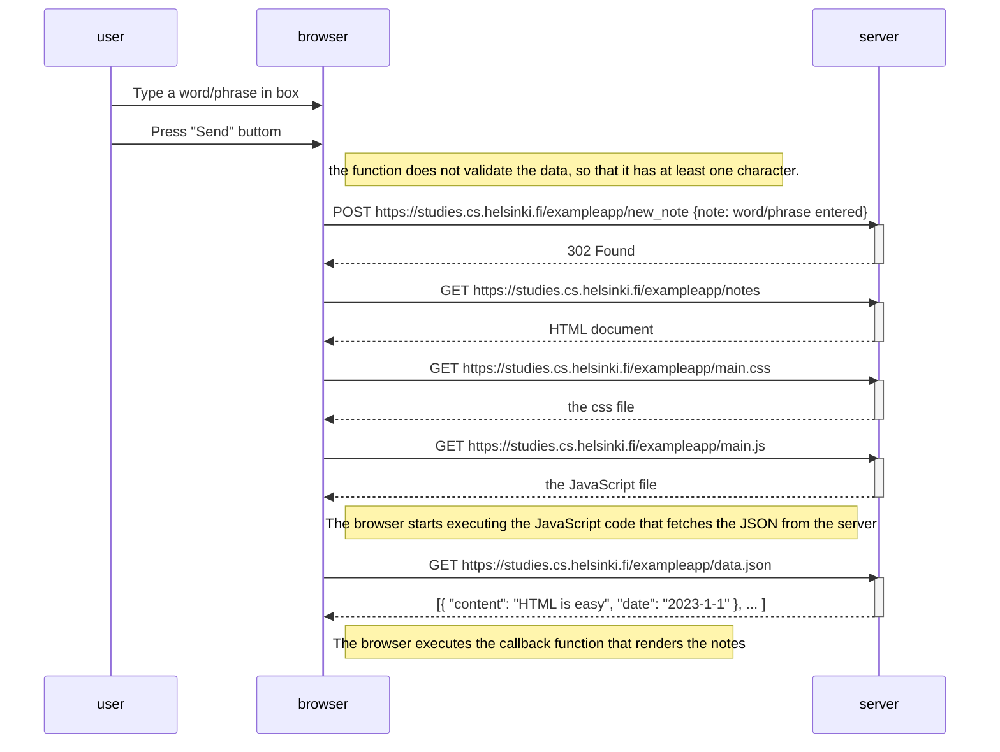

```
sequenceDiagram
    participant user
    participant browser
    participant server

    user->>browser: Type a word/phrase in box
    user->>browser: Press "Send" buttom
    Note right of browser: The function does not validate the data, so that it has at least one character.
    browser->>server: POST https://studies.cs.helsinki.fi/exampleapp/new_note {note: word/phrase entered}
    activate server
    server-->>browser: 302 Found
    deactivate server

    browser->>server: GET https://studies.cs.helsinki.fi/exampleapp/notes
    activate server
    server-->>browser: HTML document
    deactivate server

    browser->>server: GET https://studies.cs.helsinki.fi/exampleapp/main.css
    activate server
    server-->>browser: the css file
    deactivate server

    browser->>server: GET https://studies.cs.helsinki.fi/exampleapp/main.js
    activate server
    server-->>browser: the JavaScript file
    deactivate server

    Note right of browser: The browser starts executing the JavaScript code that fetches the JSON from the server

    browser->>server: GET https://studies.cs.helsinki.fi/exampleapp/data.json
    activate server
    server-->>browser: [{ "content": "HTML is easy", "date": "2023-1-1" }, ... ]
    deactivate server

    Note right of browser: The browser executes the callback function that renders the notes

```

