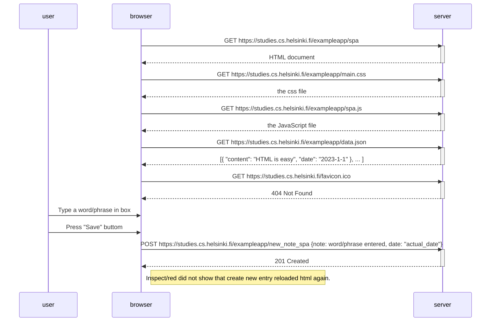

```
sequenceDiagram
    participant user
    participant browser
    participant server

    browser->>server: GET https://studies.cs.helsinki.fi/exampleapp/spa
    activate server
    server-->>browser: HTML document
    deactivate server

    browser->>server: GET https://studies.cs.helsinki.fi/exampleapp/main.css
    activate server
    server-->>browser: the css file
    deactivate server

    browser->>server: GET https://studies.cs.helsinki.fi/exampleapp/spa.js
    activate server
    server-->>browser: the JavaScript file
    deactivate server

    browser->>server: GET https://studies.cs.helsinki.fi/exampleapp/data.json
    activate server
    server-->>browser: [{ "content": "HTML is easy", "date": "2023-1-1" }, ... ]
    deactivate server

    browser->>server: GET https://studies.cs.helsinki.fi/favicon.ico
    activate server
    server-->>browser: 404 Not Found
    deactivate server

    user->>browser: Type a word/phrase in box
    user->>browser: Press "Save" buttom
    browser->>server: POST https://studies.cs.helsinki.fi/exampleapp/new_note_spa {note: word/phrase entered, date: "actual_date"}
    activate server
    server-->>browser: 201 Created
    deactivate server

    Note right of browser: Inspect/red did not show that create new entry reloaded html again.
```

